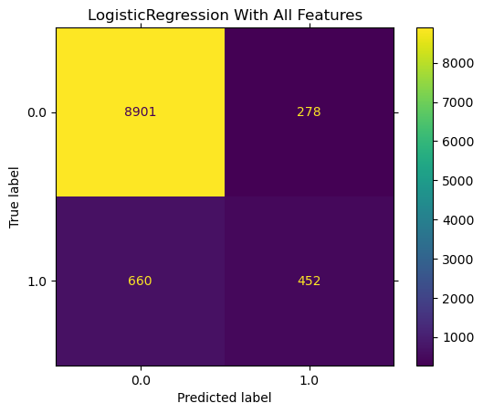

# Forecasting Bank Offer Success through Marketing Campaigns
This involves using data analytics and predictive modeling techniques to anticipate the effectiveness and outcomes of marketing efforts aimed at promoting bank offers. This process typically includes analyzing historical data, customer demographics, market trends, and campaign performance metrics to make informed predictions about how different marketing strategies will impact the uptake and success of bank offers. By leveraging these insights, banks can optimize their marketing strategies to enhance customer engagement, increase conversions, and ultimately achieve their business objectives more effectively.
## Introduction
Bankers require insights into the effectiveness of their current campaigns and the ability to forecast the performance of future campaigns.

## Notebook

You can access the Jupyter notebook [here](prompt_III.ipynb), which includes comprehensive data analysis, model development, and noteworthy discoveries.

## Project Organization

The project contains the following files and directories.
* **data** folder contains the dataset
* **images** folder plots of various data and model analysis
* CRISP DM of bank dataset pdf document
* Jupyter Notebook file
* README file

## Dataset
The dataset comprises more than 400,000 records with diverse features, which will be utilized for constructing a model.

## Data Understanding
The dataset contains 400,000 records with 21 features, all of which are complete without any null values. 
We identified and removed 12 duplicated records as they may not contribute additional value. Below is the plot illustrating the duplicates:

## Data Analysis
Here are some of the plots that show the data analysis of the dataset.
### Univariate Analysis
Here are several plots depicting feature analysis:

This plot illustrates the acceptance of offers based on customers' educational qualifications. Individuals with university degrees show a higher acceptance rate.

This plot displays the distribution of job statuses among customers, with a significant portion holding blue-collar positions.

This histogram reveals a notable imbalance in the data, indicating that a larger number of customers are not accepting offers compared to those who do accept.

### Multivariate Analysis
Here are several plots illustrating the multivariate analysis of various features:

This plot depicts the age at which customers accepted offers across different educational levels. Customers aged 30-50 show a higher acceptance rate across various educational backgrounds.

This plot indicates that married individuals tend to accept fewer offers compared to single individuals.

Additionally, here are more plots related to multivariate analysis:

 

These plots provide further insights into acceptance patterns based on housing status and marital status.

Furthermore, here are plots depicting the correlations between each feature in the dataset:

These plots show both positive and negative correlations among features in the dataset.

## Data Processing
This dataset includes numerous categorical features such as job, marital status, education, default status, housing, loan status, contact method, and month.

Ordinal features like month and day were encoded using **OrdinalEncoding**, while other categorical features were encoded using **LabelEncoder**.

As requested, only the first 7 features were selected to assess their importance:

This plot highlights that **age** significantly influences the outcome more than other features.

## Model Building

After applying **StandardScaler**, the following plot visualizes the balance between the train and test splits of the target class:

The plot indicates an imbalance between the train and test splits. Techniques such as sklearn's **resample** or **stratify** methods can be employed to balance the target classes.

### Base Models

I trained the following models and compared their performance:

* Logistic Regression
* KNN
* Decision Tree Classifier
* SVC
* LinearSVC
* SGDClassifier
* GaussianNB

The plot below illustrates their performance:

From the plot, it is evident that while the DecisionTreeClassifier has a higher training score than all other models, its test score is considerably lower. Models such as Logistic Regression, SVC, and LinearSVC demonstrate better overall performance.

Additionally, here are the training times for these models:

Notably, SVC requires more time to train compared to the other models.

### Fine-Tuned Models

I utilized **GridSearchCV** to fine-tune hyperparameters for the following models:
* Logistic Regression
* KNN
* Decision Tree Classifier
* LinearSVC
* SGDClassifier

Below is the performance plot, which highlights that Logistic Regression, LinearSVC, and SGDClassifier exhibit higher scores compared to the other models.

### Model Accuracy

Below are the confusion matrix plots for various models:

  

These confusion matrices indicate that while the models correctly predict customers who did not accept offers, they also make incorrect predictions regarding customers who did accept offers. This suggests that these models may be overfitting to the training data.

### LogisticRegression with PCA

LogisticRegression was evaluated using all features and incorporating PCA for dimensionality reduction. Implementing these techniques significantly improved the model, achieving a baseline score of 90%.

Below is the confusion matrix depicting predictions on the training set:

This plot illustrates that the model accurately predicted true positives for approximately 50% of the target classes.

## Conclusion
Here are several noteworthy observations from training these classification models:

* **Data Imbalance**:
  The dataset exhibits imbalance among the target classes. Addressing these imbalances could potentially enhance model performance.

* **Model Predictions**:
  While all classification models accurately predict instances where offers are not accepted, they struggle with correctly predicting instances where customers do accept offers. This discrepancy is likely due to the data imbalance.

* **Additional Techniques**:
  Implementing additional techniques such as ensemble methods or dataset oversampling could potentially improve model performance by addressing the challenges posed by data imbalance.

* **Exploring Ensemble Models**:
  Exploring ensemble classification models like BaggingDecisionTree, RandomForest, etc., coupled with hyperparameter tuning, could further enhance the model's predictive capabilities.

## Author
* Polsani, Prashanth Kumar (https://github.com/polsanip)